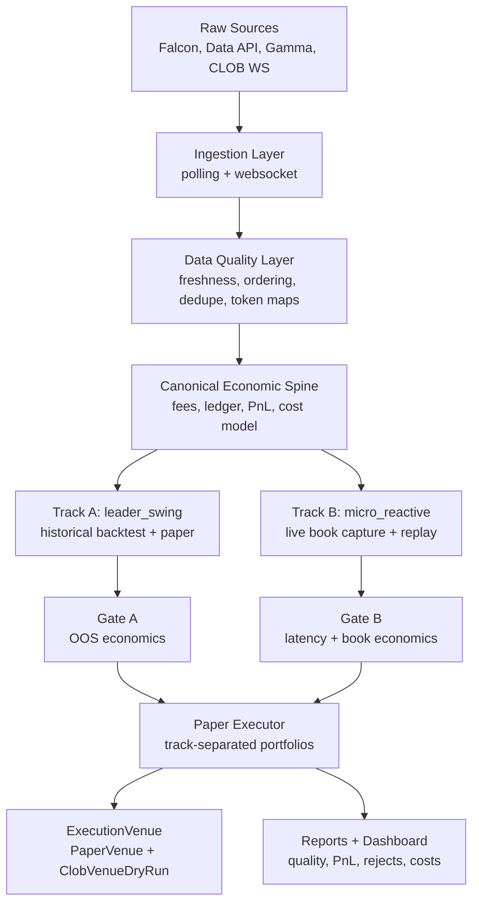

# V1 Gate Program Design

> **Objectif:** restructurer le projet Polymarket trading bot autour d'un programme V1 paper-only, execution-ready, prouve par gates economiques distincts pour `leader_swing` et `micro_reactive`.
>
> **Decision centrale:** gate economique d'abord. L'architecture ne doit etre industrialisee que pour les tracks qui prouvent un edge net apres fees, spread, slippage, latence et contraintes de fill.

---

## 1. Probleme A Resoudre

Le projet actuel contient des briques utiles, mais il donne une impression de maturite superieure a sa realite economique. Les anciens PnL, outcomes et apprentissages ne peuvent plus servir de preuve parce que les unites, les fees, les fills et la logique de couts ne sont pas suffisamment fiables.

La V1 ne doit pas chercher a "faire tourner tout le bot". Elle doit repondre a une question plus dure :

> Existe-t-il au moins un track, `leader_swing` ou `micro_reactive`, qui produit un signal exploitable en paper live, apres couts conservateurs, avec des donnees fraiches et auditees ?

Si la reponse est non, la V1 doit explicitement desactiver le trading et livrer un systeme de falsification propre. Si la reponse est oui pour un seul track, seule cette track est candidate a l'industrialisation suivante.

## 2. Principes Non Negotiables

1. **Aucun ordre reel en V1.** La V1 peut produire un ordre hypothétique via `ClobVenueDryRun`, mais aucun chemin d'execution ne doit appeler un endpoint de creation d'ordre.
2. **Tous les anciens PnL sont invalides.** Les raw events peuvent etre conserves, mais `paper_trades.pnl_usdc`, `decision_log.outcome`, `leader_profiles.decision_learning` et `error_model_blob` pre-V1 ne doivent pas servir de labels.
3. **Comptabilite canonique commune.** Backtest, paper trading et dry-run doivent utiliser le meme modele economique : shares, notional, entry/exit price, fees, spread, slippage, gross PnL, net PnL.
4. **Tracks separes.** `leader_swing` et `micro_reactive` ne doivent jamais etre melanges comme preuve de viabilite.
5. **No ambiguity, no trade.** Decision refusee si token map, fee snapshot, book freshness, unite de taille ou market state sont ambigus.
6. **Phase A n'est pas le centre.** Phase A est seulement le gate historique `leader_swing`. Elle ne prouve rien pour `micro_reactive`.
7. **Monitoring des le debut.** La qualite de data est un produit core, pas un dashboard cosmetique final.

## 3. Taxonomie Des Tracks

### 3.1 `leader_swing`

But : exploiter des comportements de wallets/leaders sur des horizons minutes-heures-jours.

Sources minimales :
- historical wallet trades ;
- market metadata ;
- snapshots/candles/orderbook si disponibles ;
- resolution data ;
- fee snapshots.

Mode de preuve :
- backtest walk-forward strict ;
- couts conservateurs ;
- baselines obligatoires ;
- paper live avec fills simules sur carnet ou prix executable conservateur.

Gate :
- net PnL OOS positif ;
- Sharpe net superieur a 0.5 ;
- drawdown borne ;
- performance non concentree sur 1 ou 2 trades ;
- baseline battue ;
- sensibilite aux couts acceptable.

### 3.2 `micro_reactive`

But : exploiter des mouvements tres courts lies au carnet, aux price changes, au spread et a la latence utile.

Sources minimales :
- WebSocket market channel ;
- `book` ;
- `price_change` ;
- `last_trade_price` ;
- `best_bid_ask` ;
- `tick_size_change` ;
- `market_resolved` ;
- timestamps locaux et exchange ;
- orderbook snapshots persistants.

Mode de preuve :
- pas de backtest serieux tant que la capture carnet haute frequence n'existe pas ;
- periode pilote de capture live ;
- replay sur carnets persistés ;
- fill simulator non optimiste.

Gate :
- uptime WS mesuré ;
- book age p95 compatible avec horizon du signal ;
- gaps rares et expliques ;
- edge net superieur a spread + fees + slippage ;
- reject rate comprehensible ;
- fill simulator auditables.

## 4. Architecture Cible V1



La couche economique doit etre en dessous des deux strategies. Elle n'est pas une lib utilitaire : c'est le contrat comptable du projet.

## 5. Objets Et Interfaces Cibles

### 5.1 `StrategyTrack`

Enum obligatoire :
- `leader_swing`
- `micro_reactive`

Present dans :
- decisions ;
- paper trades ;
- signal audits ;
- reports ;
- risk state ;
- portfolio state ;
- model labels.

### 5.2 `economic_model_version`

Version obligatoire pour tout PnL, fill, label, report et decision learning.

Regle : aucun rapport ne peut agreger deux versions sans le declarer explicitement.

### 5.3 `CanonicalTrade`

Representation d'un trade observe :
- market id ;
- token id ;
- side ;
- outcome side ;
- price ;
- size shares ;
- notional USDC ;
- timestamp exchange ;
- timestamp observed ;
- source ;
- raw payload reference.

### 5.4 `CanonicalFill`

Representation d'un fill simule ou paper :
- strategy track ;
- market id ;
- token id ;
- side ;
- liquidity role ;
- size shares ;
- notional USDC ;
- entry/exit price ;
- fee snapshot id ;
- spread cost ;
- slippage cost ;
- gross PnL ;
- net PnL ;
- fill model version ;
- reject reason si non execute.

### 5.5 `FeeSnapshot`

Snapshot versionne :
- market id ;
- token id ;
- fee enabled ;
- fee rate ;
- maker/taker assumption ;
- source ;
- timestamp ;
- CLOB V2 compatibility metadata.

La formule Polymarket cible pour taker fees est :

```text
fee_usdc = shares * fee_rate * price * (1 - price)
```

Maker fee : zero par defaut en V1, sauf preuve contraire par snapshot officiel.

### 5.6 `SignalAudit`

Audit de decision :
- strategy track ;
- inputs references ;
- feature snapshot ;
- cost assumptions ;
- book snapshot reference ;
- fee snapshot reference ;
- model versions ;
- accept/reject ;
- reject reason ;
- expected edge ;
- expected net edge apres couts.

### 5.7 `ExecutionVenue`

Interface :
- `PaperVenue` actif ;
- `ClobVenueDryRun` autorise ;
- aucune venue reelle active en V1.

`ClobVenueDryRun` doit produire l'ordre qui aurait ete envoye et prouver qu'il n'a rien envoye.

## 6. Programme Au-Dessus Des Phases

### Phase 0 - Economic Reset

Objectif : supprimer les illusions de validite.

Livrables :
- migration d'invalidation ;
- script d'invalidation pre-V1 ;
- secret hygiene ;
- risk manager branche ;
- garde-fous pour empecher les anciens PnL d'entrer dans les rapports V1.

Gate :
- aucun aggregate V1 ne peut inclure un label pre-V1 non versionne.

### Phase 1 - Canonical Economic Spine

Objectif : rendre le PnL mathematiquement coherent.

Livrables :
- module economics ;
- fee model officiel ;
- ledger FIFO ;
- YES/NO BUY/SELL ;
- partial close ;
- merge YES+NO ;
- resolution handling ;
- unit tests complets.

Gate :
- tous les tests economics/ledger/fees passent ;
- aucune decision economique ne passe sans unites explicites.

### Phase 2A - `leader_swing` Proof Gate

Objectif : prouver ou refuter l'edge leader avec historique.

Livrables :
- data loader historique ;
- backtester walk-forward ;
- baselines ;
- couts conservateurs ;
- report OOS.

Gate :
- net PnL OOS positif ;
- Sharpe net > 0.5 ;
- baseline battue ;
- performance non concentree ;
- sensibilite aux couts documentee.

### Phase 2B - `micro_reactive` Data Gate

Objectif : prouver que la data live est assez fraiche pour une strategie micro.

Livrables :
- WS capture minimale ;
- parser market channel ;
- book snapshots persistants ;
- latency/freshness monitor ;
- replay simple sur carnets persistés.

Gate :
- book gaps rares ;
- latency p95 compatible ;
- book age compatible ;
- spread/depth mesurés ;
- reject reasons traçables.

### Phase 3 - Strategy Isolation

Objectif : empecher les metrics combinees de mentir.

Livrables :
- `strategy_track` partout ;
- portfolios separes ;
- budgets separes ;
- risk profiles separes ;
- reports separes ;
- dashboard par track.

Gate :
- aucune metrique combinee ne peut servir de go/no-go sans decomposition par track.

### Phase 4 - Paper V1

Objectif : valider live sans ordre reel.

Livrables :
- paper executor commun ;
- simulated fills sur carnet ou prix conservateur ;
- audit trail par fill ;
- rapports quotidiens ;
- 2 a 4 semaines de periode probatoire.

Gate :
- paper live converge avec backtest/replay ;
- net PnL positif apres couts conservateurs ;
- rejects explicables ;
- aucune ouverture au midpoint, last brut ou `1 - leader_price` sans book.

### Phase 5 - Execution-Ready Dry Run

Objectif : preparer l'architecture d'execution sans pouvoir trader reellement.

Livrables :
- `ExecutionVenue` ;
- `PaperVenue` ;
- `ClobVenueDryRun` ;
- blockers stale book/missing fee/missing token/max exposure/max daily loss/kill switch ;
- audit d'ordre hypothétique.

Gate :
- zero chemin possible vers ordre reel ;
- audit trail complet d'un ordre hypothetique ;
- CLOB V2 compatibility verifiee.

### Phase 6 - V1 Go/No-Go

Objectif : decider froidement.

Livrables :
- rapport final par track ;
- cost sensitivity ;
- ablations ;
- data quality report ;
- recommendation go/no-go.

Gate :
- au moins un track passe ses gates ;
- l'autre track reste explicitement desactive s'il echoue ;
- aucun contournement manuel des blockers.

## 7. Donnees Et Qualite

Les donnees doivent etre classees par niveau de confiance :

1. Raw immutable events.
2. Canonical normalized events.
3. Derived features.
4. Decisions.
5. Simulated fills.
6. PnL labels.
7. Learning labels.

Regle : on peut toujours recalculer les niveaux 2 a 7 depuis les raw events et les snapshots versionnes. Si ce n'est pas possible, la donnee n'est pas admissible pour V1.

## 8. Couts Et Microstructure

La V1 doit mesurer explicitement :
- fees ;
- spread ;
- slippage ;
- latency ;
- stale book rejection ;
- fill probability ;
- depth disponible ;
- market resolution risk ;
- exposure par market/category/leader/track ;
- daily loss ;
- PnL net par track.

Tout signal qui ne survit pas a une simulation de couts conservatrice est considere non exploitable, meme si le signal brut est statistiquement interessant.

## 9. Observabilite

Dashboard V1 minimal :
- WS status reel ;
- last message age ;
- book age ;
- spread ;
- depth ;
- latency p50/p95/p99 ;
- fee availability ;
- token map availability ;
- rejected signals par reason ;
- paper PnL net par track ;
- gross-to-net cost bridge ;
- data gaps.

Ce dashboard est core. Il doit arriver avant paper V1 complet, pas apres.

## 10. CI Et Verification

Commandes minimales :

```bash
pytest -q
ruff check .
```

Sous-ensembles obligatoires :

```bash
pytest tests/test_economics -q
pytest tests/test_observer -q
pytest tests/test_engine -q
```

Une V1 ne peut pas etre declaree prete si les tests economics, ledger, fee model, parser WebSocket, replay et safety dry-run ne passent pas.

## 11. Ce Qui Est Explicitement Hors V1

- ordre reel ;
- optimisation ML avancee ;
- Hawkes/graph comme gate core ;
- dashboard cosmetique ;
- aggregation FOLLOW/FADE ou track combinee comme preuve ;
- PnL base sur anciens labels ;
- execution au midpoint ;
- fee assumptions hardcodees non versionnees.

## 12. Critere De Succes V1

La V1 est acceptable si :

1. Les anciens labels sont invalides et exclus.
2. Le moteur economique commun est teste.
3. `leader_swing` et `micro_reactive` ont des gates distincts.
4. Au moins un track passe son gate economique et operationnel.
5. Le paper live montre un PnL net positif avec couts conservateurs.
6. L'execution architecture existe en dry-run seulement.
7. Le dashboard montre les data quality failures avant qu'elles contaminent les decisions.

Si aucun track ne passe, la V1 reussie est une V1 de falsification : elle prouve proprement qu'il ne faut pas trader.

