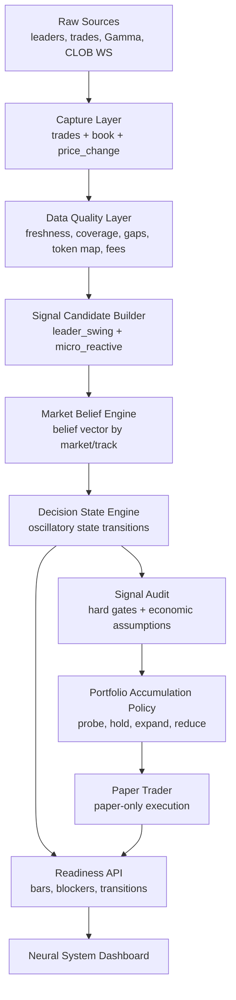

# Neural Readiness Layer V1 Design

> **Objectif:** transformer la demande de progress bars du "Neural System" en couche de pilotage V1 qui suit, explique et contraint la prise de decision en continu.
>
> **Decision centrale:** la V1 ne doit pas chercher une decision unique et definitive. Elle doit maintenir un etat vivant par marche et par track, capable de decider tot en paper, puis de se readapter a chaque flux de donnees sans jamais contourner les gates economiques et data-quality.

---

## 1. Probleme A Resoudre

Le systeme actuel sait deja produire des decisions `FOLLOW`, `FADE` ou `SKIP` a partir de trades leaders. Cette logique est utile, mais elle reste trop lineaire pour la V1 cible :

```text
leader trade -> readiness fixe -> confidence -> decision -> paper trader
```

La demande produit est plus ambitieuse : le bot doit voir ou il en est dans sa comprehension globale, commencer a prendre des decisions paper tres tot quand le signal le justifie, puis reajuster en permanence sa conviction, ses criteres de fiabilite et son exposition portfolio en fonction du flux carnet, des leaders, des couts, du risque et des resultats paper.

La progress bar ne doit donc pas etre un indicateur cosmetique. Elle doit etre la surface visible d'un moteur d'etats.

## 2. Mission De La Page Neural System

La page `Neural System` doit devenir le cockpit V1 de controle decisionnel.

Elle doit repondre a cinq questions utilisateur :

1. **Le systeme collecte-t-il assez de donnees fiables pour apprendre ?**
2. **Quel marche est le plus proche d'une premiere position paper ?**
3. **Pourquoi le systeme ne trade-t-il pas encore ?**
4. **Quand une position paper peut-elle etre accumulee ou reduite ?**
5. **Quelle track est candidate au go/no-go V1 : `leader_swing`, `micro_reactive`, aucune, ou les deux separement ?**

La page ne doit pas vendre une impression de maturite. Elle doit montrer les blocages, les transitions d'etat, les raisons de rejet, la qualite du carnet, l'edge net apres couts et la distance restante avant un go/no-go V1.

## 3. Principes Non Negociables

1. **Paper-only en V1.** Les nouveaux etats peuvent ouvrir, reduire ou fermer des positions paper. Ils ne peuvent pas envoyer d'ordre reel.
2. **No ambiguity, no trade.** Si token map, fee snapshot, book freshness, market state ou sizing sont ambigus, l'etat devient un blocage explicite.
3. **Tracks separees.** `leader_swing` et `micro_reactive` ont leurs propres etats, preuves, seuils, reports et progress bars.
4. **Economie avant expansion.** Une position paper peut etre testee tot, mais l'accumulation exige un edge net apres fees, spread, slippage, latence et fill assumptions.
5. **Anciennes preuves exclues.** Les PnL et labels pre-V1 ne peuvent pas alimenter les readiness ou les go/no-go.
6. **Dashboard comme produit core.** Les progress bars doivent etre derivees de donnees auditees, pas de valeurs inventees cote UI.
7. **Adaptation encadree.** Les seuils souples peuvent s'adapter avec la data; les gates de securite V1 ne s'adaptent jamais.

## 4. Constat Sur Le Code Actuel

### 4.1 Decision

`src/engine/confidence_engine.py` emet aujourd'hui une decision centree leader avec :

- readiness fixe (`FOLLOW_MIN_TRADES`, `FOLLOW_MIN_FOLLOWERS`, `FADE_MIN_RESOLVED`) ;
- actions `FOLLOW`, `FADE`, `SKIP` ;
- Thompson sampling follow/fade ;
- contexte leader/marche ;
- emission Redis sur `decisions`.

Cette base doit rester utile pour `leader_swing`, mais elle ne suffit pas pour representer une croyance oscillatoire par marche.

### 4.2 Paper Trading

`src/engine/paper_trader.py` est deja correctement prudent sur un point important : il refuse une decision sans `signal_audit.accepted == True`.

Le Neural Readiness Layer doit donc produire un `SignalAudit` explicite avant tout passage au paper trader. Cela transforme les progress bars en gates operationnels, pas en simple affichage.

### 4.3 Carnet Et Micro-Reactive

Le websocket marche fournit des evenements utiles, mais la capture carnet persistante n'est pas encore suffisante pour prouver `micro_reactive`.

Conclusion V1 : `micro_reactive` peut avancer en data readiness et replay readiness, mais ne doit pas pretendre etre viable tant que les snapshots carnet, les gaps, la latence et le fill simulator ne sont pas auditables.

### 4.4 Dashboard

`templates/dashboard.html` contient deja une zone `Neural System`, une `Maturation Pipeline` et un helper de progress bar `prog(...)`.

Mais la page doit etre stabilisee avant ajout majeur :

- certains ids JS references ne sont pas presents dans le HTML ;
- la readiness actuelle concerne surtout les leaders, pas les marches ;
- il manque une API dediee qui expose l'etat neural global, les blockers et les candidates decisions.

## 5. Architecture Cible



Le nouveau layer se place entre les signaux et le paper trader. Il ne remplace pas le moteur de confiance au depart; il l'encadre, l'audite et le rend observable.

## 6. Etats Decisionnels

Chaque couple `(market_id, strategy_track)` possede un etat courant.

| Etat | Declencheur | Action systeme | Effet dashboard |
| --- | --- | --- | --- |
| `OBSERVE_ONLY` | Donnees insuffisantes ou marche trop flou | Collecter, ne pas trader | Barre data en progression, blockers visibles |
| `CANDIDATE_SIGNAL` | Signal detecte mais pas assez robuste | Garder en watchlist neural | Marche affiche dans les candidats |
| `PROBE_PAPER` | Signal acceptable pour test limite | Autoriser une petite position paper auditee | Barre first-position passe en zone active |
| `EXPAND_PAPER` | Preuves repetees, edge net positif, risque OK | Autoriser accumulation paper plafonnee | Barre portfolio accumulation avance |
| `HOLD` | Position ouverte, conviction stable | Conserver, ne pas ajouter | Etat neutre, monitoring continue |
| `REDUCE` | Conviction baisse ou risque augmente | Reduire ou fermer paper selon policy | Alerte de deterioration |
| `INVALIDATE_SIGNAL` | Contradiction forte, data contaminee, thesis cassee | Annuler la thesis et logguer raison | Rejet visible et exploitable |
| `NO_GO_DATA` | Token map, fee, book ou market state ambigus | Bloquer toute decision | Barre cappee sous le seuil de trade |
| `NO_GO_ECONOMICS` | Edge net negatif apres couts | Bloquer paper/expansion | Cout bridge visible |
| `NO_GO_RISK` | Exposition ou drawdown trop eleves | Bloquer sizing et accumulation | Blocage risk explicite |
| `TRACK_DISABLED` | Track echoue son gate V1 | Continuer collecte, exclure trading | Track marquee non viable |
| `V1_GO_CANDIDATE` | Track passe les preuves paper V1 | Generer rapport go/no-go dry-run | Candidat industrialisation suivante |

## 7. Vecteur De Croyance Oscillatoire

Le comportement "quasi quantique" doit etre traduit en mecanique testable :

```text
belief_vector = {
  follow: 0.00-1.00,
  fade: 0.00-1.00,
  skip: 0.00-1.00,
  no_go: 0.00-1.00
}
```

Le systeme ne choisit pas seulement l'action dominante. Il mesure aussi l'instabilite :

- **entropy:** croyance dispersee entre follow/fade/skip/no-go ;
- **flip rate:** transitions frequentes entre etats incompatibles ;
- **data shock:** changement brutal apres un nouveau book, price_change ou trade leader ;
- **hysteresis:** seuil anti-flapping avant de passer de probe a expand ou de reduce a hold.

Regle V1 :

```text
fort signal + forte oscillation = candidate, pas expansion
fort signal + faible oscillation + edge net positif + risk OK = probe ou expand
```

## 8. Chaine De Priorite

Les priorites doivent etre strictes. Un signal fort ne gagne jamais contre un blocage hard.

```text
1. hard safety gates
2. data quality gates
3. market/token/fee validity
4. economic net edge
5. risk and portfolio exposure
6. belief stability
7. signal strength
8. accumulation intent
```

Cela permet de decider tot sans tricher : le systeme peut passer en `CANDIDATE_SIGNAL` rapidement, puis en `PROBE_PAPER` avec taille minimale si les hard gates sont propres. Il ne peut passer en `EXPAND_PAPER` que lorsque la preuve data/economie/risque est plus forte.

## 9. Progress Bars V1

Les progress bars doivent etre calculees cote backend et exposees par API.

### 9.1 Global Data Accumulation

Mesure la capacite globale du systeme a apprendre.

Composants :

- websocket uptime ;
- book age p50/p95/p99 ;
- book snapshot coverage ;
- token map coverage ;
- fee snapshot coverage ;
- market metadata coverage ;
- volume de trades leaders post-V1 ;
- volume de transitions auditees.

Hard cap :

- si book freshness indisponible, `micro_reactive` est cappe sous 40 ;
- si token map ou fee snapshot manquent, first-position readiness est cappee sous 50 ;
- si donnees pre-V1 entrent dans le calcul, readiness invalidee.

### 9.2 First Paper Position Readiness

Mesure la distance jusqu'a la premiere position paper acceptable.

Composants :

- signal candidate existe ;
- `SignalAudit` complet ;
- data freshness OK ;
- fee/token/market state OK ;
- expected net edge non negatif ;
- risk manager accepte la taille minimale ;
- pas de conflit open position/re-entry.

Interpretation :

- 0-49 : observation seulement ;
- 50-74 : candidate, pas encore paper ;
- 75-89 : probe paper possible ;
- 90-100 : probe fortement justifiee, mais toujours paper-only.

### 9.3 Market Belief Stability

Mesure si la croyance est exploitable ou trop oscillatoire.

Composants :

- entropy du belief vector ;
- nombre de flips recents ;
- divergence entre leader signal et book signal ;
- variation du spread/depth ;
- recence des shocks.

Regle :

- stabilite basse = pas d'expansion ;
- stabilite moyenne = probe possible ;
- stabilite haute + economics OK = expansion paper possible.

### 9.4 Portfolio Accumulation Readiness

Mesure si le systeme peut accumuler plusieurs positions paper sans concentrer le risque.

Composants :

- capital paper disponible ;
- exposition par marche ;
- exposition par track ;
- drawdown ;
- correlation marche/theme ;
- performance nette post-V1 ;
- taux de rejets explicables ;
- nombre minimal de fills audites.

Cette barre ne peut jamais depasser la first-position readiness moyenne des marches candidats.

### 9.5 Final V1 Go/No-Go Distance

Mesure la distance vers une conclusion V1 par track.

Composants :

- PnL net paper post-V1 ;
- Sharpe net ;
- drawdown ;
- distribution des gains/pertes ;
- baseline battue ;
- cout sensitivity ;
- data quality stable ;
- sample size suffisant.

Cette barre est separee pour `leader_swing` et `micro_reactive`.

## 10. Objets Cibles

### 10.1 `MarketBeliefState`

```text
market_id
strategy_track
current_state
belief_follow
belief_fade
belief_skip
belief_no_go
data_readiness_pct
first_position_readiness_pct
belief_stability_pct
portfolio_readiness_pct
v1_go_no_go_pct
expected_gross_edge_bps
expected_net_edge_bps
oscillation_score
blockers[]
last_transition_reason
updated_at
economic_model_version
```

### 10.2 `DecisionStateTransition`

```text
market_id
strategy_track
from_state
to_state
reason
trigger_event_type
trigger_event_ref
blockers_before[]
blockers_after[]
created_at
```

### 10.3 `ReadinessSnapshot`

```text
scope: global | track | market
strategy_track optional
market_id optional
bars
blockers
top_candidates
state_counts
created_at
```

### 10.4 `BookQualitySnapshot`

```text
market_id
token_id
book_age_ms
spread_bps
depth_top_levels
mid_price
best_bid
best_ask
gap_detected
source_timestamp
observed_at
```

## 11. API Dashboard

Ajouter une API dediee :

```text
GET /api/neural-readiness
```

Reponse cible :

```json
{
  "global": {
    "bars": {
      "data_accumulation_pct": 62,
      "first_position_readiness_pct": 48,
      "belief_stability_pct": 55,
      "portfolio_accumulation_pct": 12,
      "v1_go_no_go_pct": 18
    },
    "blockers": ["missing_fee_snapshot", "insufficient_book_coverage"],
    "state_counts": {
      "OBSERVE_ONLY": 18,
      "CANDIDATE_SIGNAL": 4,
      "PROBE_PAPER": 0,
      "EXPAND_PAPER": 0,
      "NO_GO_DATA": 3
    }
  },
  "tracks": {
    "leader_swing": {
      "bars": {
        "data_accumulation_pct": 68,
        "first_position_readiness_pct": 58,
        "belief_stability_pct": 61,
        "portfolio_accumulation_pct": 15,
        "v1_go_no_go_pct": 24
      },
      "top_candidates": ["market_123"]
    },
    "micro_reactive": {
      "bars": {
        "data_accumulation_pct": 34,
        "first_position_readiness_pct": 0,
        "belief_stability_pct": 0,
        "portfolio_accumulation_pct": 0,
        "v1_go_no_go_pct": 0
      },
      "top_candidates": []
    }
  },
  "markets": [
    {
      "market_id": "market_123",
      "question": "Will example event happen?",
      "strategy_track": "leader_swing",
      "state": "CANDIDATE_SIGNAL",
      "bars": {
        "data_accumulation_pct": 72,
        "first_position_readiness_pct": 58,
        "belief_stability_pct": 64,
        "portfolio_accumulation_pct": 0,
        "v1_go_no_go_pct": 0
      },
      "blockers": ["expected_net_edge_not_confirmed"],
      "last_transition_reason": "leader_signal_detected"
    }
  ],
  "transitions": [
    {
      "market_id": "market_123",
      "strategy_track": "leader_swing",
      "from_state": "OBSERVE_ONLY",
      "to_state": "CANDIDATE_SIGNAL",
      "reason": "leader_signal_detected",
      "created_at": "2026-04-21T12:00:00Z"
    }
  ]
}
```

La page `Neural System` doit afficher :

- les cinq progress bars globales ;
- les bars separees par track ;
- les meilleurs marches candidats ;
- les blockers dominants ;
- les dernieres transitions d'etat ;
- les raisons pour lesquelles le systeme n'est pas encore autorise a accumuler.

Avant cet ajout, le HTML/JS doit etre stabilise : les ids references par `renderSystem`, `renderRisk` et le side panel doivent exister ou etre null-guarded.

## 12. Integration Avec `SignalAudit`

Toute transition vers `PROBE_PAPER` ou `EXPAND_PAPER` doit produire un `SignalAudit`.

Le `SignalAudit` doit inclure :

- track ;
- market id ;
- token id ;
- decision state ;
- feature snapshot ;
- book snapshot reference ;
- fee snapshot reference ;
- expected gross edge ;
- expected net edge ;
- blockers ;
- accepted true/false ;
- reject reason ;
- economic model version.

Le paper trader ne doit recevoir que des decisions auditees. Une decision non auditee reste visible sur le dashboard, mais ne peut pas devenir une position.

## 13. Adaptation Des Criteres

Les criteres doivent s'adapter selon la phase, mais seulement sur les seuils souples.

| Phase | Seuils adaptables | Gates non adaptables |
| --- | --- | --- |
| `OBSERVE_ONLY` | volume minimal de donnees a collecter ensuite | token map, market validity |
| `CANDIDATE_SIGNAL` | score signal, watchlist priority | old PnL exclusion |
| `PROBE_PAPER` | taille minimale, confidence minimale | paper-only, signal audit, data freshness |
| `EXPAND_PAPER` | rythme d'accumulation, max candidates | net edge, risk caps, track separation |
| `V1_GO_CANDIDATE` | reporting cadence | proof post-V1, economics version |

Cela preserve l'intuition utilisateur : le systeme apprend tot et bouge vite, mais il ne ment pas sur son niveau de preuve.

## 14. Portfolio Accumulation Policy

L'accumulation ne doit pas etre une consequence automatique d'une bonne decision.

Elle doit etre decidee par une policy separee :

```text
can_accumulate = (
  state in [EXPAND_PAPER, HOLD]
  and signal_audit.accepted
  and expected_net_edge_bps > min_edge
  and belief_stability_pct >= min_stability
  and risk_caps_ok
  and portfolio_concentration_ok
)
```

Actions possibles :

- `do_not_open` ;
- `open_probe_paper` ;
- `add_paper_size` ;
- `hold_existing` ;
- `reduce_paper_size` ;
- `close_paper_position`.

## 15. Error Handling

| Probleme | Comportement attendu |
| --- | --- |
| Redis indisponible | Pas de nouvelle position paper, dashboard degrade |
| DB indisponible | Pas de transition persistante, pas de paper opening |
| book stale | `NO_GO_DATA` ou cap readiness |
| fee snapshot absent | `NO_GO_DATA` |
| token map ambigue | `NO_GO_DATA` |
| expected edge net negatif | `NO_GO_ECONOMICS` |
| oscillation trop forte | pas d'expansion |
| risk cap atteint | `NO_GO_RISK` |
| vieux label pre-V1 detecte | exclu du calcul et blocker systeme |

## 16. Plan D'Implementation Propose

### Phase 1 - Contrats Et Tests

- definir les enums d'etats ;
- definir les schemas `MarketBeliefState`, `DecisionStateTransition`, `ReadinessSnapshot` ;
- ajouter tests unitaires de transition et de caps readiness ;
- verifier que les gates hard bloquent toujours le paper.

### Phase 2 - Capture Et Qualite Carnet

- persister ou agreger les snapshots carnet utiles ;
- calculer book age, spread, depth, gaps ;
- exposer `BookQualitySnapshot` au layer neural ;
- capper `micro_reactive` tant que la capture n'est pas suffisante.

### Phase 3 - Market Belief Et Decision State Engine

- consommer decisions leader existantes comme signaux candidats ;
- produire belief vector par marche/track ;
- calculer oscillation, entropy, stability ;
- persister transitions d'etat.

### Phase 4 - SignalAudit Et Paper Probe

- generer `SignalAudit` avant paper trader ;
- permettre `PROBE_PAPER` avec sizing minimal ;
- refuser toute decision sans audit ;
- logguer les reject reasons.

### Phase 5 - Portfolio Accumulation

- ajouter la policy d'accumulation separee ;
- gerer `HOLD`, `REDUCE`, `EXPAND_PAPER` ;
- garder les caps par track et par marche.

### Phase 6 - API Et Dashboard

- ajouter `/api/neural-readiness` ;
- stabiliser les ids HTML/JS existants ;
- ajouter les cinq progress bars ;
- afficher candidates, blockers et transitions.

### Phase 7 - Rapport Go/No-Go

- produire une vue track-separee ;
- exclure toute preuve pre-V1 ;
- afficher si la V1 prouve `leader_swing`, `micro_reactive`, les deux ou aucune.

## 17. Tests Requis

Tests backend :

- hard gates cap readiness ;
- transition `CANDIDATE_SIGNAL -> PROBE_PAPER` exige `SignalAudit` accepte ;
- `EXPAND_PAPER` impossible si edge net negatif ;
- oscillation haute bloque expansion ;
- tracks jamais agregees dans un go/no-go ;
- anciens labels pre-V1 exclus.

Tests API :

- `/api/neural-readiness` retourne schema stable ;
- blockers et bars sont presents meme sans donnees ;
- degradation propre si Redis/DB partiellement indisponibles.

Tests dashboard :

- smoke test DOM : aucun `getElementById(...).textContent` ou `.innerHTML` sur element absent ;
- rendu des progress bars sur desktop/mobile ;
- candidates et blockers lisibles sans overlap.

## 18. Hors Scope V1

- envoi d'ordres reels ;
- merge des preuves `leader_swing` et `micro_reactive` ;
- optimisation automatique non bornee des seuils hard ;
- utilisation des anciens PnL comme labels ;
- dashboard marketing ou vanity metrics.

## 19. Critere De Succes

Le layer est reussi si l'utilisateur peut ouvrir `Neural System` et comprendre immediatement :

- combien de data fiable le systeme a accumulee ;
- quel marche est le plus proche d'une premiere position paper ;
- pourquoi le bot ne trade pas encore quand il est bloque ;
- quand il peut probe, hold, expand, reduce ou invalidate ;
- quelle track avance vraiment vers un go/no-go V1.

Le meilleur outcome possible n'est pas forcement "le bot trade". Le meilleur outcome V1 est que le bot sache prouver, avec des donnees propres, quand il peut trader en paper et quand il doit explicitement ne pas trader.
